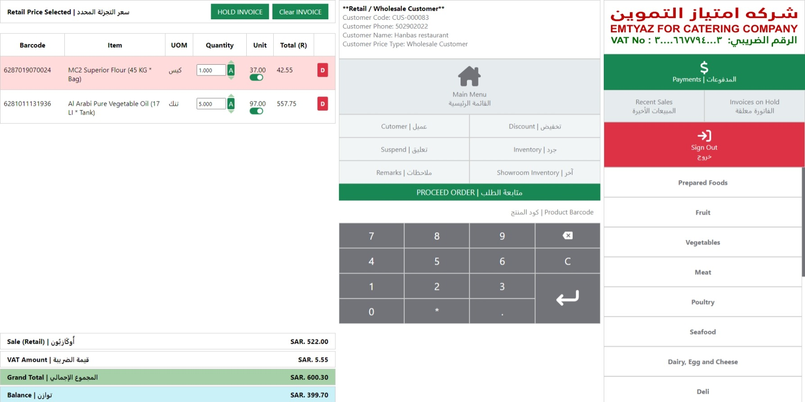

# Point Of Sale Project For Emtyaz



## Introduction

This README provides an overview of the project setup and highlights the changes made to the database structure. It also includes SQL update statements to apply these changes and insert statements to add new records to specific database tables.

## Project Setup

### Table of Contents

- Installing Composer
- Installing Project Dependencies
- Database Configuration

### Installing Composer

Composer is a dependency manager for PHP. To install it, follow these steps:

1. Visit Composer's official website for detailed installation instructions.
2. Once Composer is installed, open a command prompt or terminal window.
3. Verify that Composer is installed by running:

```bash
composer --version

```

You should see the version number if Composer was installed successfully.

### Installing Project Dependencies

Before running the project, you need to install its dependencies. In your project directory, run:

```bash
composer install
```

This will download and install all the required packages specified in the composer.json file.

### Setting Up pdo_sqlsrv Extension

To use the `pdo_sqlsrv` extension in PHP for SQL Server database connections, follow these steps:

1. Locate your `php.ini` file. You can often find it in the PHP installation directory.
2. Open `php.ini` in a text editor.
3. Search for the `extension=php_pdo_sqlsrv` and `extension=php_sqlsrv` lines.
4. Uncomment these lines by removing the semicolon at the beginning of each line.
5. Save and close `php.ini`.

Ensure that you have the SQL Server drivers installed and properly configured on your server. for more detailed guide check out https://learn.microsoft.com/en-us/sql/connect/php/loading-the-php-sql-driver?view=sql-server-ver16

## Database Changes


### [CodeMaster].[PaymentMethod] Table

- Added a new record with RecID 5 for both Cash and Card payments.

```sql
    INSERT INTO [CodeMaster].[PaymentMethod] (RecID, Code, Description, Remarks)
    VALUES (5, 'Cash-Card', 'Cash and Card Payment', 'Cash and Card Payment Method');
```

### [GlobalSetup].[POSInvoiceStatus] Table

- Created to track invoice hold statuses.

```sql
    CREATE TABLE [GlobalSetup].[POSInvoiceStatus] (
    RecID INT PRIMARY KEY,
    Code VARCHAR(30),
    Description VARCHAR(50),
    Remarks VARCHAR(50)
);
```

- Added records to the table.

```sql
    INSERT INTO [GlobalSetup].[POSInvoiceStatus] (RecID, Code, Description, Remarks)
    VALUES (1, 'PENDING', 'Pending Invoice', 'Invoice is pending');

    INSERT INTO [GlobalSetup].[POSInvoiceStatus] (RecID, Code, Description, Remarks)
    VALUES (2, 'APPROVED', 'Approved Invoice', 'Invoice has been approved');

    INSERT INTO [GlobalSetup].[POSInvoiceStatus] (RecID, Code, Description, Remarks)
    VALUES (3, 'CANCELLED', 'Cancelled Invoice', 'Invoice has been cancelled');

    INSERT INTO [GlobalSetup].[POSInvoiceStatus] (RecID, Code, Description, Remarks)
    VALUES (4, 'HOLD', 'Hold Invoice', 'Invoice is on hold');

```

### [GlobalSetup].[ProductSource] Table

- Created to store product sources.

```sql
    CREATE TABLE [GlobalSetup].[ProductSource] (
    RecID INT PRIMARY KEY,
    Name VARCHAR(30),
);
```

- Added two initial records:

```sql
    INSERT INTO [GlobalSetup].[POSInvoiceStatus] (RecID, Name)
    VALUES (1, 'Warehouse');

    INSERT INTO [GlobalSetup].[POSInvoiceStatus] (RecID, Name)
    VALUES (2, 'Showroom');
```

### [POS].[InvoiceDetailTemporary] Table,

- Added a new column: `ProductSourceRecID` to track the source of products (defaults to 1 for Warehouse).

```sql
    ALTER TABLE [POS].[InvoiceDetailTemporary]
    ADD ProductSourceRecID INT DEFAULT 1
```

### [POS].[InvoiceDetail] Table

- Added a new column: `ProductSourceRecID` to track the source of products (defaults to 1 for Warehouse).

```sql
    ALTER TABLE [POS].[InvoiceDetail]
    ADD ProductSourceRecID INT DEFAULT 1
```

### [POS].[V_InvoiceDetailTemporary] View

- Added a new column: `RetailPrice`.
- Added a new column: `ProductSourceRecID`.
- Added a new column: `PriceTypeRecID`

```sql
    -- Existing code,
    CONVERT(DECIMAL(10, 2), Inventory.V_Product.RetailPrice) AS RetailPrice,
    POS.InvoiceDetailTemporary.ProductSourceRecID
    POS.InvoiceDetailTemporary.PriceTypeRecID
    -- Existing code,
```

### [POS].[V_InvoiceDetail] View

- Added a new column: `ProductSourceRecID`.

```sql
    -- Existing code,
    POS.InvoiceDetail.ProductSourceRecID
    -- Existing code,
```
